# 进阶

## 安全

```shell
# 查看是否设置密码
CONFIG get requirepass
# 设置密码
CONFIG set requirepass "password"
# 使用密码登录
AUTH password
```

```shell
# 获取所有配置项
CONFIG GET *
# 查看当前客户端配置
info 
```


## 持久化

分为RDB和AOF两种持久化方式

### RDB

使用以下两条命令后会在指定的文件夹中生成指定文件名称的文件用于数据持久化

```shell
# 立刻执行
save 
# 后台执行
bgsave
```

#### 注意事项

save指令的执行会阻塞当前Redis服务器,知道当前RDB完成为止,有可能造成长时间阻塞

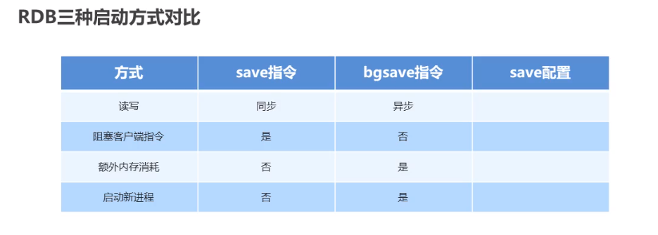

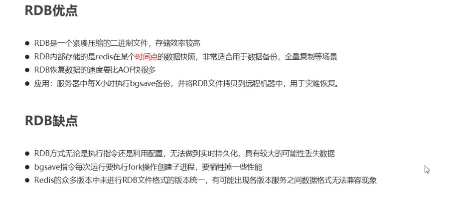


### AOF

使用日志的方式存储,通过配置开自动开启,记录的是执行的命令,可以通过重写的方式缩小文件大小

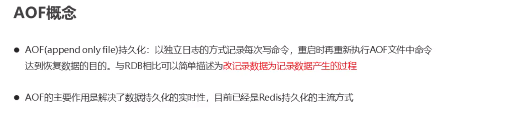

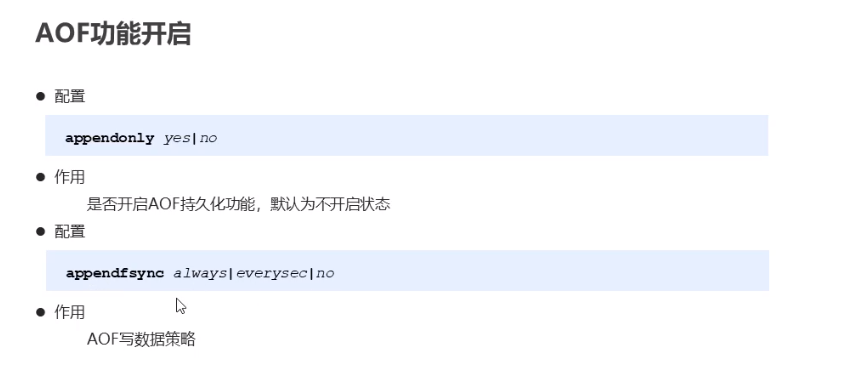

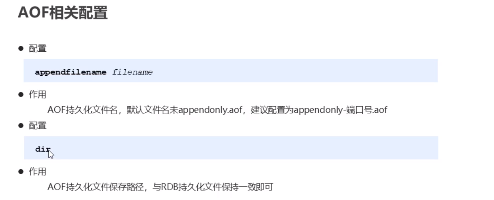

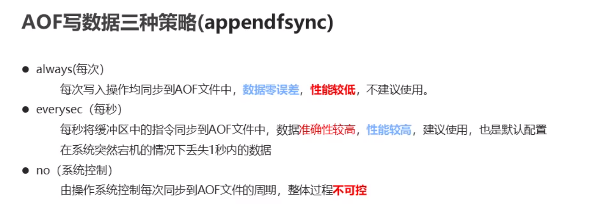

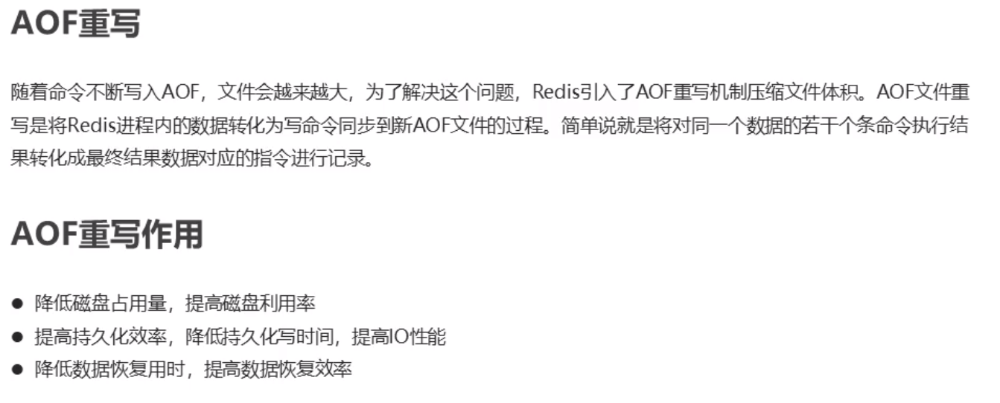

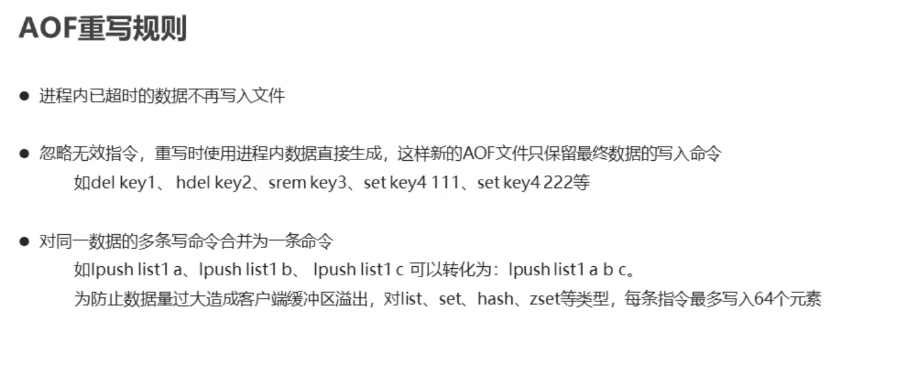

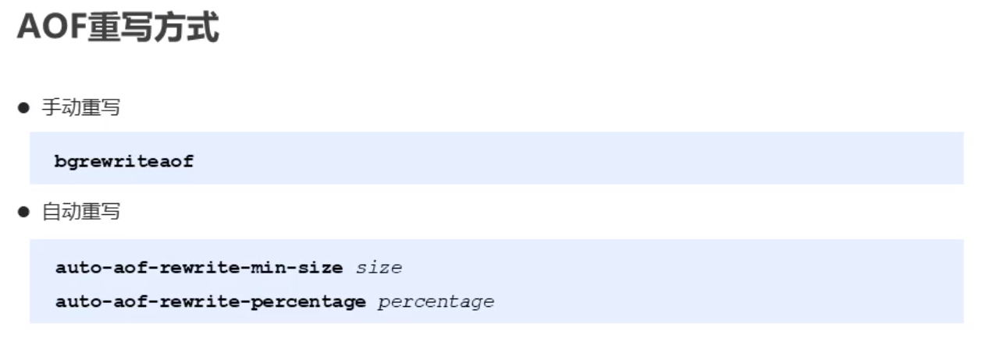

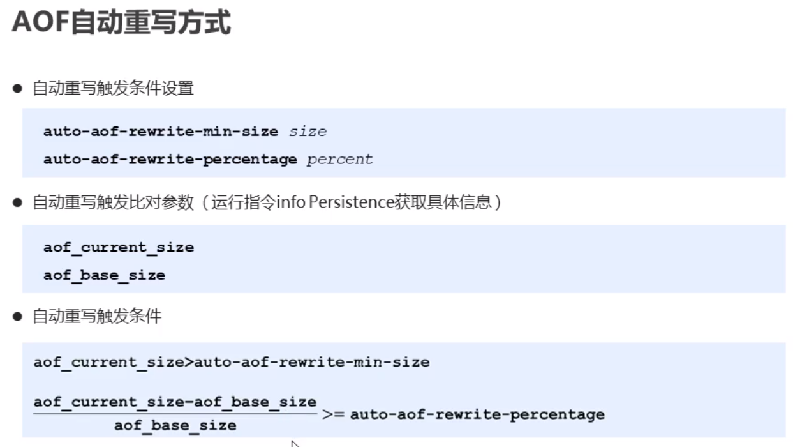


### RDB和AOF持久化的比较

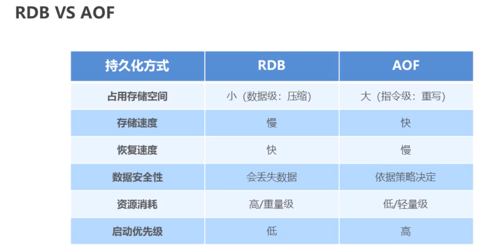


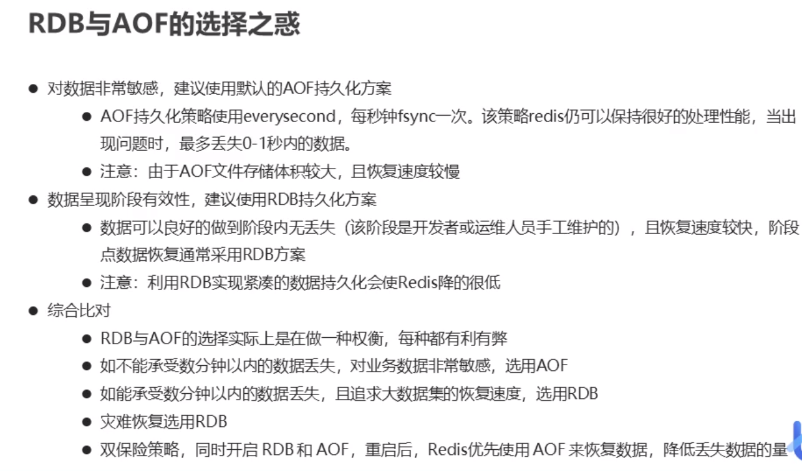


## 事务

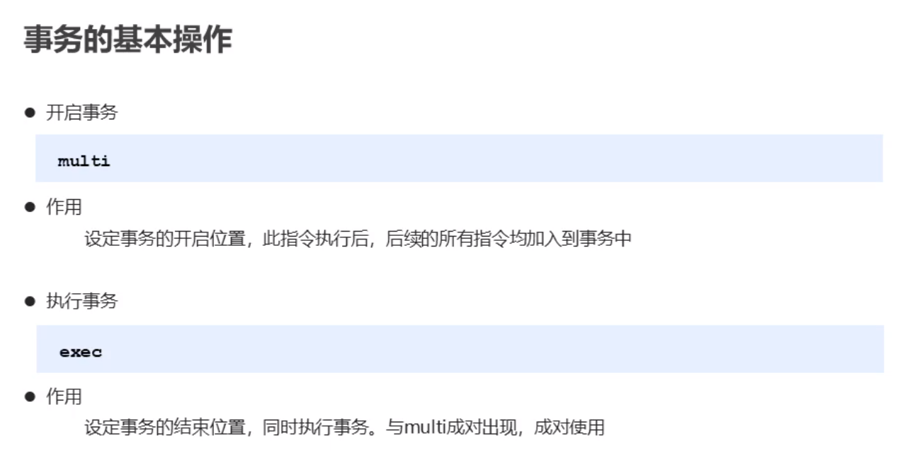

取消事务

不会针对某个事务,执行命令后会清除存在的所有事务

```
discard
```

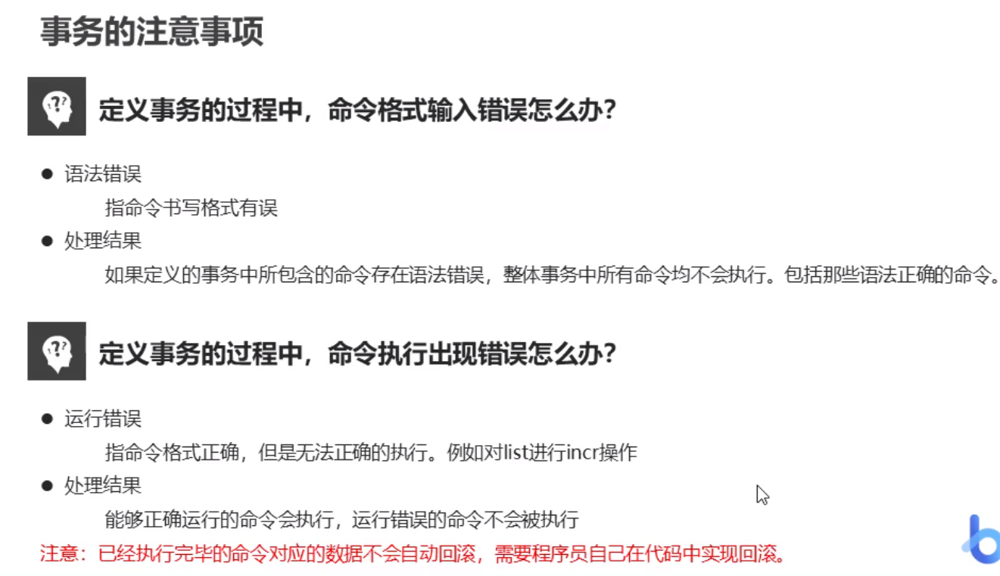

### 事务锁

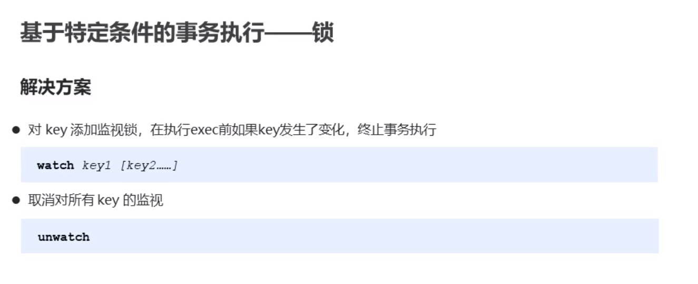

watch必须在事务前执行

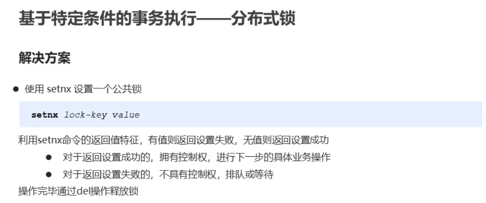

### 解决死锁问题

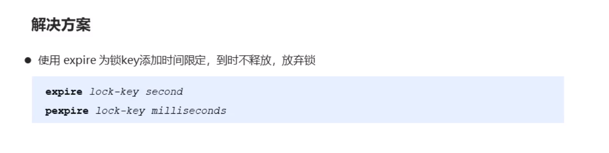


## 删除策略

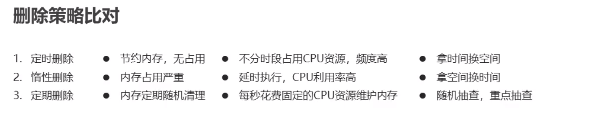

定时: 设置一个定时器,expire(设置了定时元素的存储空间,存储元素的地址值和过期时间)中的元素到达过期时间立刻删除

惰性: 当元素到达过期时间如果服务器压力过大不会立刻删除,等到在获取时再进行删除

定期: 每隔一段时间对内存中的数据进行随机抽查,把抽查到的过期数据删除


## 高级数据类型


