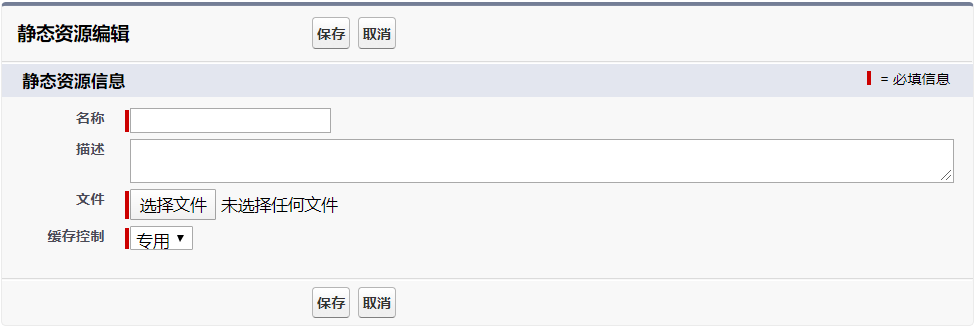

# Visualfore

​	Visualforce是一个和Apex语言相匹配的开发框架,开发者可以使用Visualforce和Apex建立网络应用程序,其基本功能类似于前端框架,可以构建页面,与Apex中的进行数据交流,并将结果显示给用户,相当于MVC中的V

## 基本使用

```xml
<!-- sideBar="false" 用来控制页面的侧边栏 默认为true显示侧边栏 -->
<!-- showHeader 该属性值如果为false,可以让用户完全自定义页面,也就是不会显示任何原来的组件   -->
<apex:page  showHeader="false" id="HelloVisualPage">
    <h1>
        This is title.
    </h1>

    <p>
        This is content of p tag.
    </p>

<!--    vp可以与后端进行数据的交流拿并到数据,-->
<!--    可以使用表达式获取-->
<!--    基本语法: {! 变量或表达式的名字} -->
<!--    变量和表达式可以是基本的数据类型,也可以是sObject对象-->
    <p>
<!--        这两个表达式是系统自带 这里的数据为当前用户的名称 -->
<!--        属于全局变量,需要在变量名前面加 $ 来获取-->
        {!$User.FirstName} + {!$User.LastName}
<!--        还可以进行计算-->
        {! 1+1}

    </p>
    <p>
        <!--  显示当前年份   -->
        {! YEAR(TODAY())}
    </p>
    <p>
        <!--        三元运算符-->
         {! IF(1 > 2,'1大于2','1小与2')}
    </p>

    <apex:pageBlock title="page block title">
        <apex:pageBlockSection title="page block section title">
            This is inside page block section.
        </apex:pageBlockSection>
    </apex:pageBlock>
</apex:page>
```

## 绑定列表变量

```xml
<apex:pageBlock title="Account Info">
    <!--            该组件可以循环对象列表中的每个元素的内容-->
    <!--            value属性决定组件循环的列表的是那个对象列表-->
    <!--            var属性代表循环中每一个对象的名称-->
    <apex:pageBlockTable value="{! accounts }" var="acc">
        <!--                使用表达式获取对象中的属性-->
        <apex:column value="{! acc.Id }"/>
        <apex:column value="{! acc.Name }"/>
        <apex:column value="{! acc.Phone }"/>
    </apex:pageBlockTable>
</apex:pageBlock>
```

## 控制器扩展

page

```xml
<!-- 在page已经有标准控制器变量后,还可以使用extensions变量指定扩展类 -->
<apex:page standardController="Account" id="BasePage" extensions="ExampleControllerExtension">
    <p>
        111111111
    </p>
    {!ExampleCustomMessage}
</apex:page>
```

扩展类

```java
/**
 * Created by T on 2020/4/28.
 */

public class ExampleControllerExtension {
    private final Account acc;

    // 扩展类的构造函数必须使用ApexPages.StandardController类型的参数
    public ExampleControllerExtension(ApexPages.StandardController stdController) {
        // 使用标准控制器变量的getRecord()方法来得到相应SObject对象的值
        this.acc = (Account)stdController.getRecord();
    }

    //    方法需要加get前缀,但是在变量表达式调用时不需要加get前缀
 
    public String getExampleCustomMessage() {
        return 'Hello world!!!';
    }
}
```

## 自定义控制器

Salesforce有默认的“get函数”机制，可以从控制器类中自动得到页面中使用的变量的值

当页面中使用变量“abc”，那么“abc”的值会自动由控制器中的“getAbc()”函数来得到。

此机制适用于单独对象变量和列表对象变量。

自定义控制器

```java
public class CustomAccountListController {
    public List<Account> getMyAccounts() {
        List<Account> results = Database.query(
                'SELECT Id, Name, Phone, Fax ' +
                        'FROM Account ' +
                        'LIMIT 10'
        );
        return results;
    }
}
```

页面

```xml
<!--        自定义控制器使用controller,将页面与自定义的类建立关系 -->
<apex:page showHeader="false" controller="CustomAccountListController" id="CustomAccountListView">
    <apex:pageBlock title="Account Info">
        <apex:pageBlockTable value="{! myAccounts }" var="acc">

            <apex:column value="{! acc.Id }"/>
            <apex:column value="{! acc.Name }"/>
            <apex:column value="{! acc.Phone }"/>
            <apex:column value="{! acc.Fax }"/>

        </apex:pageBlockTable>
    </apex:pageBlock>
</apex:page>
```

## 创建自定义对象

进入设置界面，搜索“对象”，选择“创建”菜单下的“对象”链接，即可进入“自定义对象”界面。

在“自定义对象”界面中，点击“新建自定义对象”，进入“新建自定义对象”界面。


## 静态资源

在设置中搜索静态资源,选择新建,设置一个唯一的名称,在页面使用的是该名称,上传文件后保存



页面中使用静态资源

使用 $Resource. 调用js文件,在script标签中调用具体的方法

```xml
<apex:page >
    <apex:includeScript value="{! $Resource.HelloJS }"/>
     <script type="text/javascript">
        myFuntion();
    </script>
</apex:page>
```

