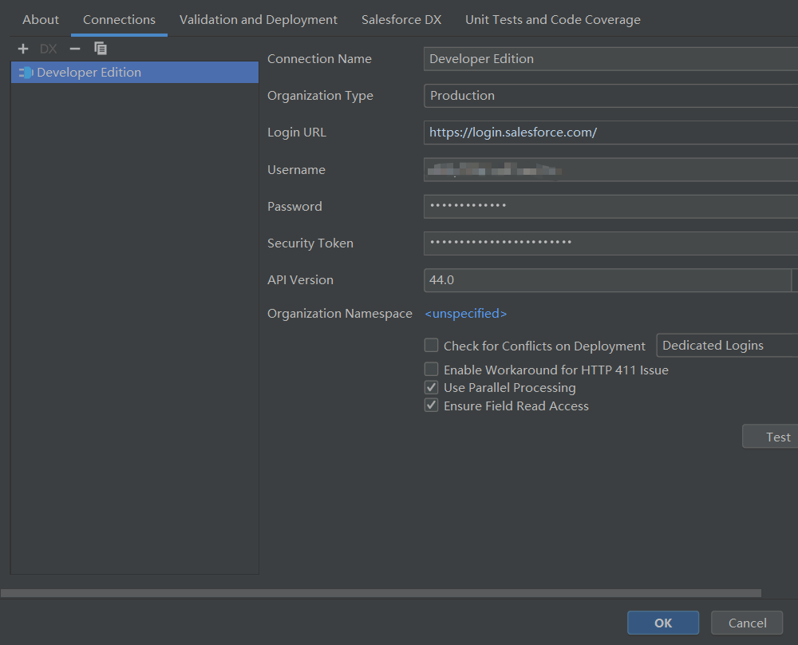
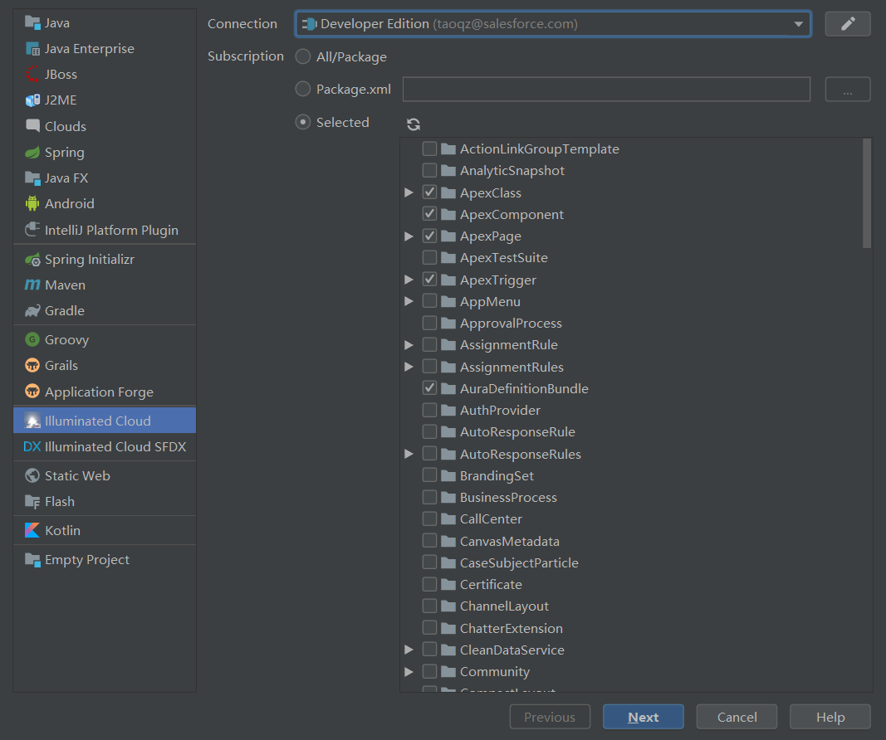
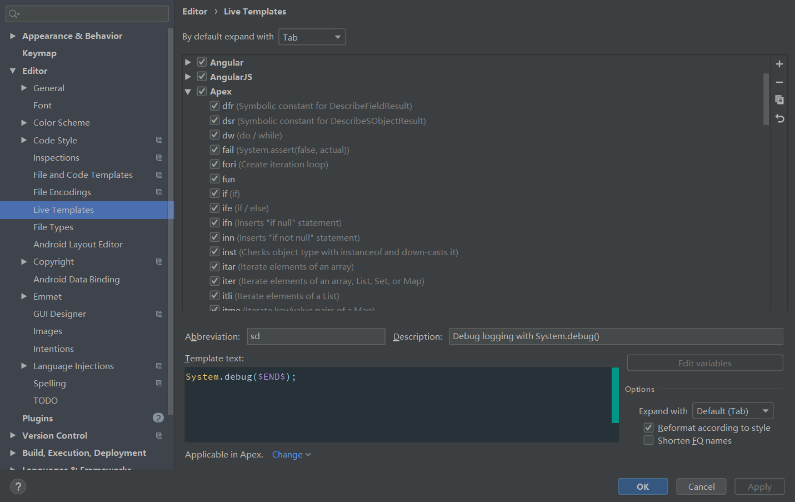
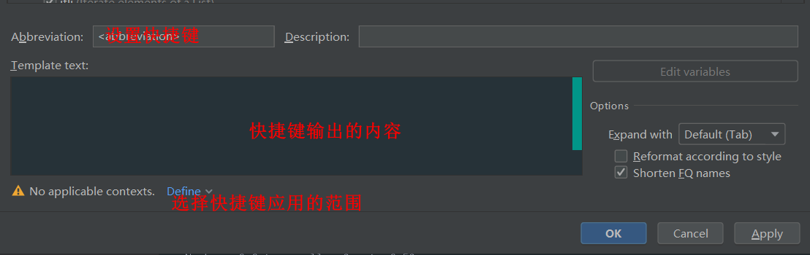

IDEA实在是太强大了,简直什么都能写

注册好salesforce环境后,记得账号密码

打开IDEA,双击shift所有plugins,找到illuminated Cloud插件,点击安装后重启

在IDEA窗口中找到build --> illuminated Cloud --> Configure Application对项目进行配置

输入对应的账号密码

Security Token的获取,在salesfoce中找到

我的设置 --> 个人 --> 重新设置我的安全标记找到后点击重新设置安全标记按钮,会将安全验证码发送到注册时使用的邮箱,填入到一下配置项中即可

 

配置好后,选择创建一个新的项目,选择对应的选项Connection,就是我们刚才添加的配置,项目创建好后会自动加载salesforce云端中的数据(Apex类等等)

在IDEA的设置中查询以及自定义快捷键

其中该插件针对Apex有许多预定义的快捷键,如果需要自定义快捷键,点击右边的+号选择Live Template

参考链接:https://zhuanlan.zhihu.com/p/53627319