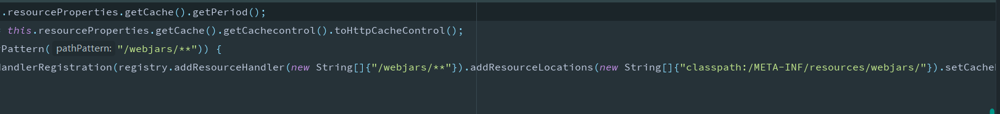

# 什么是SpringBoot?

​	简化了Spring项目的搭建和开发过程,可以整合其他框架,简单,快速,快变


## 项目结构:	

​	springboot项目启动后会自动扫描与其在同一目录下的文件夹


## 创建webapp目录,以及使用jsp

​	需要添加依赖

```xml
<!--jsp页面使用jstl标签 -->
<dependency>
    <groupId>javax.servlet</groupId>
    <artifactId>jstl</artifactId>
</dependency>

<!--用于编译jsp -->
<dependency>
    <groupId>org.apache.tomcat.embed</groupId>
    <artifactId>tomcat-embed-jasper</artifactId>
    <scope>provided</scope>
</dependency>
```

​	创建webapp目录应该与Java和resources目录同级

​	标记为web目录:Modules --> 点击项目下的Web,将webapp路径添加到下图


## 热部署

​	需要的依赖:

```xml
<!--热部署配置-->
<dependency>
    <groupId>org.springframework.boot</groupId>
     <artifactId>spring-boot-devtools</artifactId>
</dependency>
```

​	**properties:**

```properties
#开启热部署
spring.devtools.restart.enabled=true
#设置重启文件目录
spring.devtools.restart.additional-paths=src/main/java
#页面不加载缓存，修改即时生效
spring.thymeleaf.cache=false
```

​	**idea需要的配置:**	


## webjars

​	WebJars可以让大家 以Jar 包的形式来使用前端的各种框架、组件。

​	WebJars 是将客户端（浏览器）资源（JavaScript，Css等）打成 Jar 包文件，以对资源进行统一依赖管理。WebJars 的 

Jar 包部署在 Maven 中央仓库上,可以让我们对前端资源也以jar包的方式进行依赖管理

​	通过查看mvc的自动配置类可以看到前端资源配置的虚拟路径和映射路径

​	引入时,在src创建与pom文件中组件名称相同的空文件夹 webjars/artifactId/version

​	例如 : src/webjars/jquery/3.3.1 



​	官网:<https://www.webjars.org/>

​	所需依赖:

```xml
<!--Webjars版本定位工具（前端）-->
<dependency>
    <groupId>org.webjars</groupId>
    <artifactId>webjars-locator-core</artifactId>
</dependency>

<dependency>
    <groupId>org.webjars</groupId>
    <artifactId>jquery</artifactId>
    <version>3.3.1</version>
</dependency>
```

​     测试访问路径:http://localhost:8080/webjars/jquery/3.3.1/jquery.js

​     对应在jsp中引用:<script src="webjars/jquery/3.3.1/jquery.js"></script>


## 读取配置文件数据

​	@propertySource : 指定配置文件

​	@ConfigurationProperties : 指定配置文件中属性的前缀

​	@Value("${配置文件中的属性}")

配置文件 application.properties

```properties
server.port=8080
user.username=zzz
```

```java
@Component
@ConfigurationProperties(prefix = "user")
@PropertySource(value = "classpath:application.properties")
public class User {

    private String username;

    public String getUsername() {
        return username;
    }

    public void setUsername(String username) {
        System.out.println("通过set方法赋值");
        this.username = username;
    }
```

```java
@RestController
@RequestMapping("/hello")
public class HelloController {

    @Autowired
    private User user;

    @Value("user.username")
    private String username;

    @GetMapping("/user")
    public User getUser(){
        return user;
    }

    @GetMapping("/username")
    public String getUserName(){
        return user.getUsername();
    }

}
```


## 日期格式转换

​	前台传递后台按照指定格式接收:

​		方式一:在bean属性上添加注解

​		@DateTimeFormat(pattern = "")

​		方式二:在application.properties文件中添加

​		spring.mvc.date-format=yyyy-MM-dd HH:mm:ss	

​	后台返回给前台json时的data自定义格式字符串:

​		方式一:在bean属性上添加注解

​		@JsonFormat(pattern="yyyy-MM-dd HH:mm:ss",timezone="GMT+8")

​		方式二:在application.properties文件中添加

​		spring.jackson.time-zone=GMT+8

​		spring.jackson.date-format=yyyy-MM-dd HH:mm:ss


## 静态文件

​	阅读源码可以看到WebMvcAutoConfiguration 类中addResourceHandlers方法


去读ResourceProperties类中的属性


其中将默认的值赋值给了它,共有四个默认值,其优先级跟下图声明顺序一样


这几个文件夹都是在resources文件夹下的

1. classpath:/META-INF/resources/

2. classpath:/resources/

3. classpath:/static/

4. classpath:/public/

5. mvc添加该路径方便我们创建webapp目录    还可以添加webapp,在idea中添加该目录需要在project settings -- > models 选中项目的web

   有两栏添加第一个提那家web.xml路径,第二个添加webapp路径,如果jsp访问不到 如下配置,别忘记添加依赖

   

**自定义方式:**


​	       使用配置文件:

​			配置文件第一行代表添加一个静态资源文件夹路径,如果没有把默认的配置加上会覆盖默认的设置

​			同时使用自定义和默认的,用英文逗号隔开即可,前面的优先级高

​		使用java配置类:

​			实现WebMvcConfigurer接口重写addResourceHandlers,可以达到相同效果

​			映射resources下的文件夹或文件以classpath:开头 classpath:/ 代表resources根目录

​			映射磁盘下的文件以file:开头 ,其中盘符写绝对路径,盘符后的 冒号 可写可不写	

​				 例如 : file:D:/temp/upload/ 

​					   file:D/temp/upload/

​	**使用webapp目录,把js文件放在其根目录下,在webapp根目录和WEB-INF的jsp都可以从所在包直接引用**

​		**注意事项:这两种方式都会覆盖其默认配置,也就是说只配置了自己想要的路径,其默认的便会失效**

​				 **关于前端引入可以在webjars中查看**


​		参考博客

​			<https://www.jianshu.com/p/d40ee98b84b5>

​			<https://www.cnblogs.com/sxdcgaq8080/p/7833400.html>

​			[江南一点雨](https://mp.weixin.qq.com/s?__biz=MzI1NDY0MTkzNQ==&mid=2247485190&idx=1&sn=51df0c9e941f31bfe1cf32154445465b&scene=21#wechat_redirect)


## mysql驱动包 8.x 修改时区

```properties
spring.datasource.url=jdbc:mysql://localhost:3306/study?useUnicode=true&characterEncoding=utf8&serverTimezone=UTC
```


## 使用hikari连接池

导入该启动器,如果不配置其他连接池默认使用hikariCP作为连接池

```xml
  <dependency>
 	 <groupId>org.springframework.boot</groupId>
 	 <artifactId>spring-boot-starter-jdbc</artifactId>
  </dependency>
```

application.properties 关于该连接池的配置

```yaml
#数据源配置
spring.datasource.driver-class-name=com.mysql.jdbc.Driver
spring.datasource.url=jdbc:mysql://localhost:3306/数据库?useUnicode=true&characterEncoding=utf8&serverTimezone=UTC
spring.datasource.username=账号
spring.datasource.password=密码
#连接池配置
#最小空闲连接数
spring.datasource.hikari.minimum-idle=5
#池中最大连接数,包括闲置和使用的连接
spring.datasource.hikari.maximum-pool-size=15
#自动提交从池中返回的连接
spring.datasource.hikari.auto-commit=true
#连接允许在池中闲置的最长时间
spring.datasource.hikari.idle-timeout=30000
#连接池的用户定义名称，主要出现在日志记录
spring.datasource.hikari.pool-name=hikariCP
#此属性控制池中连接的最长生命周期，值0表示无限生命周期，默认1800000即30分钟
spring.datasource.hikari.max-lifetime=1800000
# 数据库连接超时时间,默认30秒，即30000
spring.datasource.hikari.connection-timeout=30000
spring.datasource.hikari.connection-test-query=SELECT 1
#打印sql日志
#mybatis.mapper-locations=classpath:mapper/*.xml
#将数据转换为指定格式+时区返回
#spring.jackson.time-zone=GMT+8
#spring.jackson.date-format=yyyy-MM-dd
#将接收的数据以指定格式存储
#spring.mvc.date-format=yyyy-MM-dd
#开启热部署
spring.devtools.restart.enabled=true
#设置重启文件目录
spring.devtools.restart.additional-paths=src/main/java
#页面热部署
#spring.thymeleaf.cache=false
```


