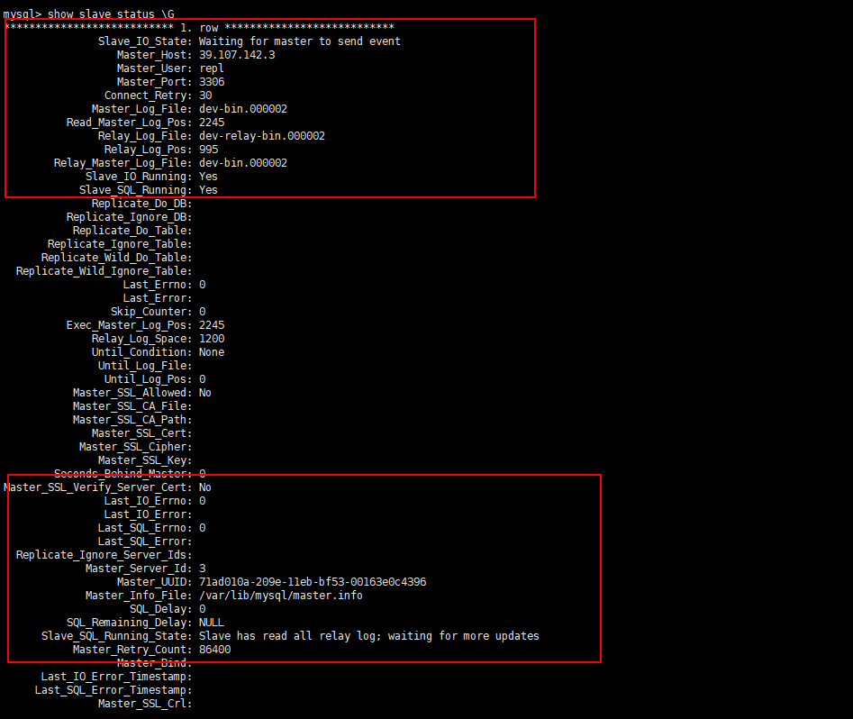
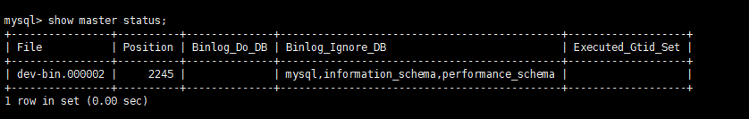
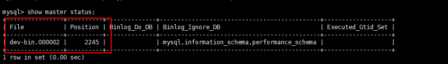

mysql 主从复制

查看从服务器状态

```sql
show slave status \G
```



查看主服务器状态

```
 show master status;
```




master配置

```properties
#Server ID，一般设置成IP地址的最后一位
server_id=3
##开启log bin，名字最好有意义用来区分
log-bin=dev-bin
##需要进行复制的数据库，可以指定数据库,这里我注释掉不用
##binlog-do-db=DB_master
##不需要备份的数据库，可以设置多个数据库，一般不会同步mysql这个库
binlog-ignore-db=mysql
binlog-ignore-db=information_schema
binlog-ignore-db=performance_schema
##为每个session 分配的内存，在事务过程中用来存储二进制日志的缓存
binlog_cache_size=1m
#  #二进制日志自动删除/过期的天数。默认值为0，表示不自动删除。
 expire_logs_days=7
#   # 跳过主从复制中遇到的所有错误或指定类型的错误，避免slave端复制中断。
#   # 如：1062错误是指一些主键重复，1032错误是因为主从数据库数据不一致
slave_skip_errors=1062
skip-name-resolve
```

salve配置

```properties
server_id=22
#binlog-ignore-db=mydql
##binlog-ignore-db=information_schema
##binlog-ignore-db=performance_schema
##log-bin=dev-slave-bin
binlog_cache_size=1M
binlog_format=mixed
expire_logs_days=7
slave_skip_errors=1062
relay_log=dev-relay-bin
##log_slave_updates=1
read_only=1
```


```bash
# 重启mysql
systemctl restart mysqld
```

```bash
# 从服务器启动slave
start slave;
# 从服务器启动slave
stop slave;
```


主服务器为从服务器添加用户权限

```sql
grant replication slave, replication client on *.* to '用户名'@'从服务器IP' identified by '密码';
```

从服务器

```bash
change master to master_host='主服务器IP',master_user='上面的用户名',master_password='上面的密码',master_port=3306,master_log_file='dev-bin.000002',master_log_pos=1261,master_connect_retry=30;
```

```
# 对应下图的FILE的值
master_log_file
# 对应下图Position的值
master_log_pos
```

```
 show master status;
```

 


先删除从库的数据,后删除主库的数据会导致问题如下(主库的更新操作会复制到从库里)

 Could not execute Delete_rows event on table mytest.tb_test; Can't find record in 'tb_test', Error_code: 1032; 

重新启动配置一下

```
stop slave ;set global sql_slave_skip_counter=1;start slave;
```

