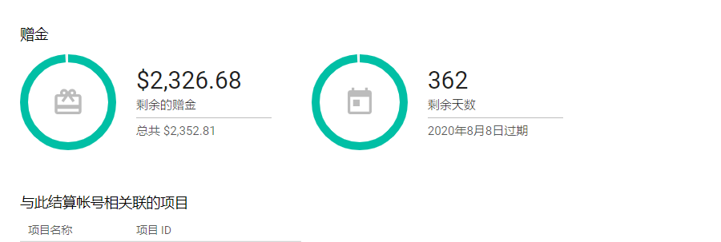
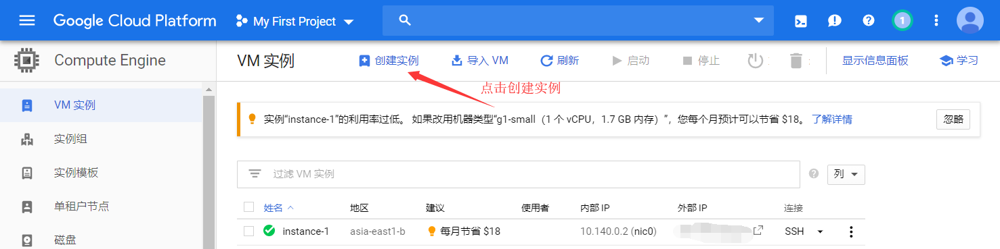
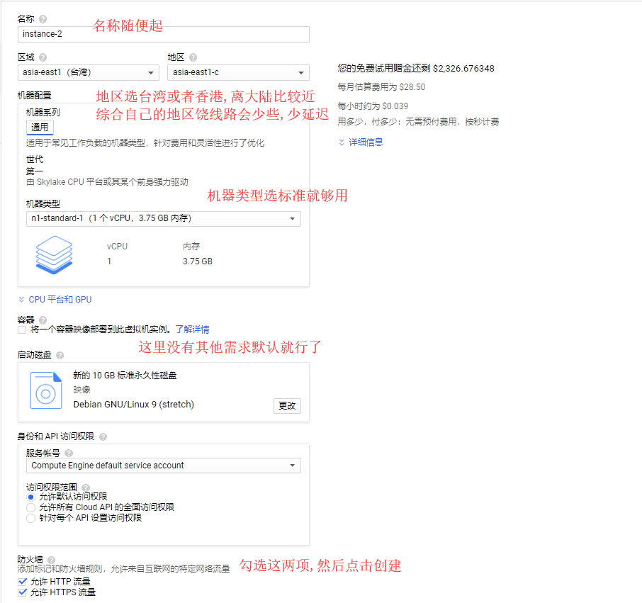
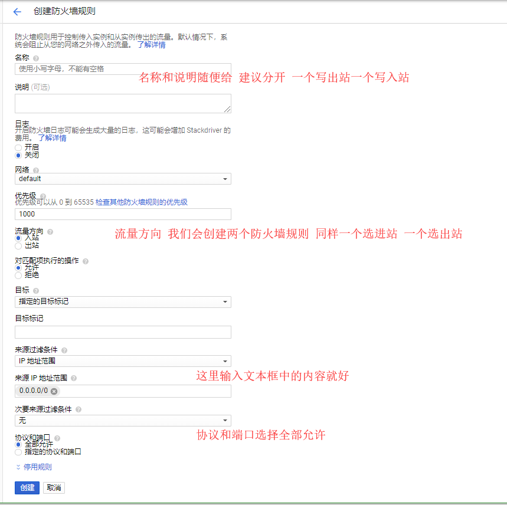
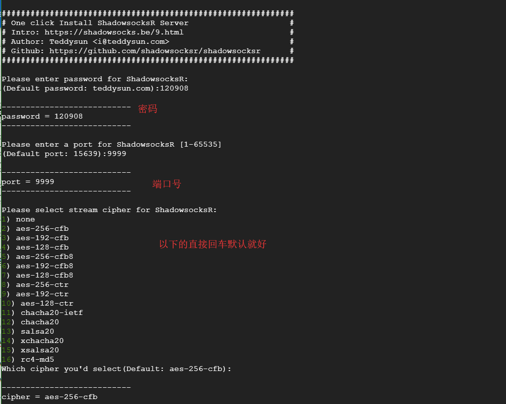
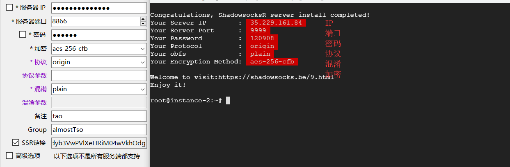

#### 使用Google Cloud搭建ssr

​	在youtube或者各种搜索引擎上已经有不少的视频和教程,写本文也是分享一下自己的经验:happy:。

​	谷歌云平台会赠送新用户300美金，免费使用一年，薅羊毛嘛:joy:。


#### 1.需要用到

​	1.1.前置的科学上网工具

​	1.2.谷歌账号

​	1.3.支持外币支付的信用卡（ps.我申请的中国银行的万事达）

​		这里放上我申请的信用卡链接:https://mp.weixin.qq.com/s/NXSM8C5mnq7I4NAlOOMlNw


#### 2.申请注册谷歌云	

​	2.1.地址:<https://cloud.google.com/free/>

​	2.2.其中的地区已经没有中国了选其他地区或国家,我选的香港,将自己的信用卡绑定后进入主页面

​	       可以看到下图说明已经成功激活谷歌云了    




#### 3.创建实例

​	**3.1.点击左上角菜单栏图标选中结算,去激活你的结算账号**

​	**3.2.选中Compute Engine**



​       **3.3.创建实例详细信息**



​	**3.4.测试延迟**

​		创建VM实例完成后,会有一个外部IP,复制该IP进行

​			测速:<https://tools.ipip.net/traceroute.php>

​		延迟在50左右还行,100以下都能用,越小越好


#### 4.创建防火墙规则

​	**4.1选中菜单栏VPC网络点击防火墙规则**

​	      **注意需要创建两个,下图中会有说明**




#### 5.开始搭建

​	**5.1.在创建好的实例有一个SSH选择在浏览器窗口打开**

​		**依次输入以下命令**

​			**5.1.1.  sudo -i 切换到root**

​			**5.1.2.  安装SSR**

```
wget --no-check-certificate https://raw.githubusercontent.com/teddysun/shadowsocks_install/master
/shadowsocksR.sh && chmod +x shadowsocksR.sh
```

​			**5.1.3.  ./shadowsocksR.sh  运行**

​	**5.2.回车运行后会看到下图,有解释说明**





**到此一个通过Google Cloud搭建的SSR就可以使用了**:beers:

